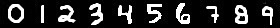

## MNIST digit analysis with multiple machine learning toolkits 

To compare the different sci-kit learn algorithms, I tested digit recognition with this kaggle dataset of images of handwritten 0 to 9’s:
https://www.kaggle.com/c/digit-recognizer

**Python toolkit (scikit-learn) and functions used for the machine learning analysis**:
```python
import pandas as pd
import copy
import numpy as np
import matplotlib.pyplot as plt, matplotlib.image as mpimg
from sklearn.model_selection import train_test_split
from sklearn import svm
from sklearn.naive_bayes import GaussianNB
from sklearn import tree
```
**In addition to the kaggle data, I drew my own sample digits to analyze**:



```python
# import my jpg of digits I wrote in paint (0 - 9)
im=plt.imread("aonum3.jpg") # 28 x 280 x3
im1=im[:,:,1]
plt.imshow(im1,cmap="hot")
imh=copy.copy(im1)
plt.hist(imh.ravel())

# re-arrange data. make image into 28 rows
im2=np.zeros((10,784),dtype=np.uint8)
for j in range(10):
    a=0+j*28
    b=28+j*28
    pic1=im1[:,a:b]
    pic2=copy.copy(pic1)
    plt.imshow(pic1)
    im2[j,:]=pic2.ravel()

# organize training data and use 20% as test data
train_data = pd.read_csv('train.csv', dtype=np.uint8) # csv from kaggle. each row is one image, one header line at top
print(train_data.head())
images = train_data.iloc[0:4000,1:] # tested different number of images
labels = train_data.iloc[0:4000,:1] # just the first col
# split into train and test subsets:
train_images, test_images,train_labels, test_labels = train_test_split(images, labels, train_size=0.8, random_state=0)

# make images binary
test_images_b=test_images
train_images_b=train_images
test_images_b[test_images_b>1]=1
train_images_b[train_images_b>1]=1
```
**Testing with naïve bayes (scores will change slightly each time due to the random sorting above)**:
```python
clfg = GaussianNB()
clfg.fit(train_images_b, train_labels.values.ravel())
clfg.score(test_images_b,test_labels)
```
- 100 images -> score = 0.3
- 1000 images -> score = 0.62
- 4000 images -> score = 0.54

**Testing with decision trees**:
```python
clfdt=tree.DecisionTreeClassifier()
clfdt.fit(train_images_b, train_labels.values.ravel())
clfdt.score(test_images_b,test_labels)
 ```
- 100 images -> score = 0.4
- 1000 images -> score = 0.63
- 4000 images -> score = 0.79

**Testing with support vector classification (highest score)**:
```python
clf = svm.SVC()
clf.fit(train_images_b, train_labels.values.ravel())
print(clf.score(test_images_b,test_labels)) 
```
- 100 images -> score = 0.25
- 1000 images -> score = 0.89
- 4000 images -> score = 0.91

**Clearly training with more images leads to greater accuracy. For curiosity’s sake, the algorithms were also tested on my handwriting using the above trained models**:
```python
im3=copy.copy(im2)
im3[im3<100]=0
im3[im3>=100]=1 # make them binary
print(clf.score(im3,range(10)))
print(clfg.score(im3,range(10)))
print(clfdt.score(im3,range(10)))
resultsAO=clfg.predict(im3)
print(resultsAO)
```
- 100 images: 0.2, 0.4, 0.2 for the SVM, naïve bayes, and decision tree models respectively 
- 1000 images: 1, .5, & .7 for the SVM, naïve bayes, and decision tree models respectively 
- 4000 images: 1, .5, & .7 for the SVM, naïve bayes, and decision tree models respectively
- 4000 images & the naïve bayes model predicts that my actual drawings of 0 to 9 are [0 1 3 2 4 6 3 9 8 9]. 

<h3>Analyzing the digit data with Matlab's neural network tools</h3>
example
example

####test the hashtags
example

